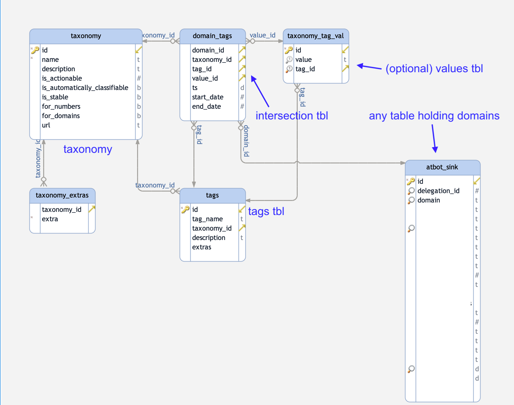

# tag2domain

The tag2domain project is a framework for creating mappings of tags (labels, annotations) to domain names. 


# Installation

This repo contains sql scripts which create the right mapping tables. See the EER diagram below for more infos.
However, it has some assumptions:

  * you use postgresql
  * you already have a table ``domains`` with a primary key ``domain_id``. The domains table shall contain a list of domain names
  * you might have to adapt the mapping table ``domain_tags`` to your needs.


```bash
psql -h $server -U $user $db < db/taxonomy.sql
psql -h $server -U $user $db < db/tags.sql
psql -h $server -U $user $db < db/taxonomy_tag_val.sql.sql
psql -h $server -U $user $db < db/domain_tags.sql

```


Note that the domain_tags intersection table might be adapted for your purposes. It is only given as an example.


# DB structure




# The global awesome taxonomy list project

There is a [global taxonomy list](https://github.com/aaronkaplan/awesome-taxonomyzoo-list) on github, which serves as a place for anyone to propose taxonomies and document them.
This list should be  constantly growing by community contributions (should this project kick off). The important aspect for us  is that every taxonomy is described as machine readable [machine-tag](https://github.com/MISP/misp-taxonomies) format.
Hence, we can include other taxonomies into our DB rather easily.


Funded by
---------

This project was partially funded by the CEF framework

.. figure:: static/cef_logo.png
   :alt: Co-financed by the Connecting Europe Facility of the European Union
