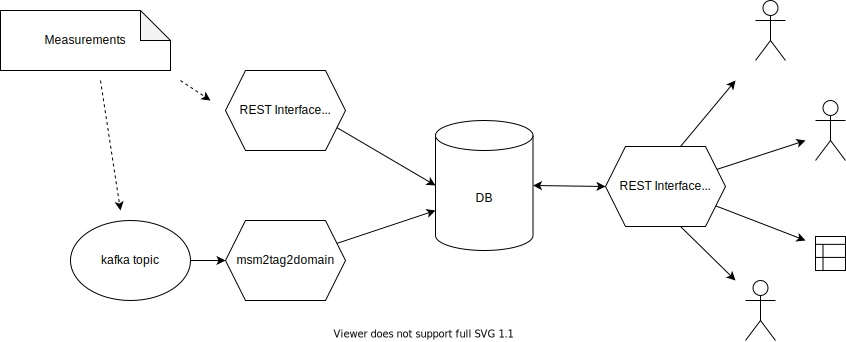

# tag2domain

## Concept
The tag2domain project is a framework for creating mappings of tags (labels, annotations) to domain names. To get an overview over the concepts you can read [this blogpost](https://cert.at/en/blog/2020/7/tag2domain).

Tags are meant to be like little sticky notes that are attached to some entity, for example, a domain name. The tags that belong to a certain topic of interest are grouped together into _taxonomies_. Additionally, each tag can be associated with a _value_ that further specifies the tag. Within a taxonomy tags can be grouped into _categories_. For the purpose of this documentation we describe a tag by writing
> (entity) taxonomy : category :: tag = value

As an example take the taxonomy "Website Language" that describes the language a website presents itself in. The tags are the languages, categories are language families and values are the confidence that the language has been detected correctly. Some example tags would then be

> (domain_example_one.at) Website Languages : Indo-European :: German = confidence-high

> (domain_example_two.at) Website Languages : Afro-Asiatic :: Arabic = manually-tagged

The same Website could present itself with multiple languages, so one website can be associated with multiple tags from the same taxonomy. Additionally, the set of languages a homepage is available in could change so each tag has a start timestamp and an end timestamp. The end timestamp may be unspecified to indicate that a property still applies (i.e. its absence has not yet been observed).

This library provides a database schema to maintain such a tagging infrastructure, services that convert individual measurements to tags, and an API that provides access to the gathered data.

## Measurements

Usually, properties are detected in discrete measurements, e.g. a web crawler visits a homepage and determines that a web page is mostly written in english. In the context of tag2domain, measurements are represented by JSON objects that have the following fields:

**MEASUREMENT**

| key                   | example                               | description                                               | required |
|-----------------------|---------------------------------------|-----------------------------------------------------------|----------|
| version               | 1                                     | version of the measurement format                          | yes      |
| tag_type              | "domain"                              | tag type - each type corresponds to an intersection table | yes      |
| tagged_id             | 42                                    | ID of the entity the measurement has been taken of. This ID must exist in the entity table that corresponds to the tag type| yes      |
| taxonomy              | "Website Languages"                  | taxonomy that has been measured                           | yes      |
| producer              | "Language Detection Bot"              | name of the process that did the measurement              | yes      |
| measured_at           | "2020-12-20T12:00:00"                 | time when the measurement was taken                       | yes      |
| measurement_id        | "ldb:576894"                          | optional measurement ID                                   | no       |
| autogenerate_tags     | true                                  | if true tag types that are not already in the taxonomy<br>are inserted. This requires that the allows_autotags <br>column of the taxonomy is set to true. | no       |
| autogenerate_values   | false                                 | if true values that are not already in the taxonomy<br>are inserted. This requires that the allows_autovalues <br>column of the taxonomy is set to true. | no       |
| tags                  | [_tag_1_, _tag_2_, ...]               | list of tags that have been found                         | yes      |

Each tag is itself a JSON object:

**TAG**

| key                   | example                               | description                                                   | required                         |
|-----------------------|---------------------------------------|---------------------------------------------------------------|----------------------------------|
| tag                   | "de"                                  | name or ID of the tag to be set                               | yes                              |
| value                 | "confidence:high"                     | value to be set                                               | no                               |
| description           | "Language: German"                    | dsecription of the tag. Required if autogenerate_tags == true | yes if autogenerate_tags is true |
| extras                | {}                                    | JSON object that contains further details about the tag       | yes if autogenerate_tags is true |

tag2domain assumes that a measurement describes a whole taxonomy. This means, that if a tag (e.g. "en") is not in a measurement of the taxonomy "Website Languages" then tag2domain assumes that there is no english language on the website.

Examples of measurements can be found [here](examples/measurements/README.md).
The schema for measurements can be found [here](py_tag2domain/schema/measurement.json).

## Components and database schema
This package provides
+ a postgres database schema that implements tag2domain,
+ the tag2domain-api, a REST interface that allows querying of the tag2domain database and that (optionally) receives property measurements, and
+ msm2tag2domain, a script that reads measurements from a kafka queue or a file and turns them into tag2domain tags.


The basic database schema is shown in the picture below. tag2domain is based on three core tables:
+ _taxonomy_: contains the available taxonomies
+ _tags_: contains the available tags
+ _taxonomy_tag_val_: contains the available values

The tags defined in these tables are assigned to _entities_ using (possibly multiple) _intersection tables_. In the example below the intersection table is named _domain_tags_ and assigns tags to domains. These domains are themselves rows in a table named _domains_. This _domains_ table must be maintained by the user (i.e. by some other program) and is not modified by tag2domain.

The glue section combines information from the intersection tables and the rest of the database into a single table that provides data to the API. In addition entities can be filtered by other criteria by setting up appropriate filter tables. See [Advanced DB Configuration](docs/advanced_db_config.md) for details of this configuration.


# Requirements
tag2domain is written in python and uses [PostgreSQL](https://www.postgresql.org/) databases. The included demos use docker to run the code.

tag2domain is written so that it can be integrated into an existing database. Doing so requires some knowledge of PostgreSQL databases.

# Installation
To get started clone the repository and navigate to the root directory:
``` bash
git clone https://gitlab.sbg.nic.at/labs/dwh/tag2domain.git
cd tag2domain/
```

The three main components of the repository can be found in these subfolders:
+ py_tag2domain (`py_tag2domain/`) - a python library that manages tags
+ tag2domain-api (`tag2domain_api/`) - a REST API for creating and fetching tags
+ msm2tag2domain (`msm2tag2domain/`) - a service that reads measurements from kafka queue and writes them to the database

To use tag2domain you will likely integrate its database tables into an existing database. A tutorial to do this integration can be found [below](#customizing-the-tag2domain-setup). To get you started quickly some "all-in-one" demo setups are included that come with a preconfigured database. In this setup you can explore the features that are available and use the configuration files as a template for your own configuration.

## Demo setups
The demo setups use [docker](https://www.docker.com/) and [docker-compose](https://docs.docker.com/compose/) to run the services. Please first make sure both are set up and working.

### The all-in-one setup
The _all-in-one_ setup consists of a mock database that mimics a registry and the tag2domain-api that allows inserting and reading tags. To start the demo move to the root folder of this repository and run the following commands:
``` bash
# copy the environment file
cp docker/all-in-one-demo/example.env ./.env

# open the .env file with your favourite editor and set the POSTGRES_USER and
# POSTGRES_PASSWORD options

# build the tag2domain-api container
docker-compose -f docker-compose.all-in-one.yml build

# bring up the database and tag2domain-api
docker-compose -f docker-compose.all-in-one.yml up -d

# check that the containers are running (both containers should be Up)
docker-compose -f docker-compose.all-in-one.yml ps
```
Open http://localhost:8001/docs in your browser  (or the equivalent address if you
don't run the containers on your local machine) and you should see the API documentation.


To inspect the database tables you can either make the mock database available
to the outside of the docker network by modifying docker-compose.all-in-one.yml
or you can exec into the db container:
``` bash
# open a bash process in the db container
docker-compose -f docker-compose.all-in-one.yml exec db bash

# inside the container open psql
# See the .env file for POSTGRES_USER setting
db> psql -U <POSTGRES_USER> tag2domain_mock_db
```

A good place to start is the `/api/v1/meta/taxonomies` endpoint that gives you
an overview over the taxonomies that are available in the mock database. The
`/api/v1/domains/bytaxonomy` endpoint with taxonomy `colors` can then be used
to retrieve a list of domains with this tag. To retrieve the tags that are set
for `domain_test1.at` use the `/api/v1/bydomain/` endpoint.

### The kafka setup
This setup uses the same mock database as the all-in-one setup but measurements
are fetched from a kafka topic by the _msm2tag2domain_ service. This setup
requires a preexisting kafka installation.

First we have to configure the kafka setup:
``` bash
# Run these commands from the root folder of the repository

# copy the env file
cp docker/all-in-one-demo/example.env ./.env

# open the .env file with your favourite editor and set the POSTGRES_USER and
# POSTGRES_PASSWORD options

# copy the configuration for msm2tag2domain
cp msm2tag2domain/docker/msm2tag2domain.cfg.example msm2tag2domain/docker/msm2tag2domain.cfg

# open msm2tag2domain/docker/msm2tag2domain.cfg and configure the database
# connection and the parameters for the kafka connection

# build the tag2domain-api and the msm2tag2domain container
docker-compose -f docker-compose.all-in-one-kafka.yml build

# bring up the database, tag2domain-api, and msm2tag2domain
docker-compose -f docker-compose.all-in-one-kafka.yml up -d

# check that the containers are running (all three containers should be up)
docker-compose -f docker-compose.all-in-one-kafka.yml ps
```

See the [measurement examples](examples/measurements/README.md) for a guide on
how to submit measurements to the kafka queue.

## Customizing the tag2domain setup
In practice you will likely want to integrate tag2domain into an existing
database so the tags can refer to entities that already exist. In this section
we show how tag2domain can be configured to work with an existing database.

### Creating the tag2domain tables
As described in a [previous section](#components-and-database-schema) tag2domain
can be linked to an existing database table that contains the entities that are
to be tagged.

To set up the tag2domain tables first generate a config file:
``` bash
# copy the example configuration
cp examples/db/db.config.sh.example db.config.sh

# open db.config.sh in your favourite text editor and set the parameters
```

Now generate the tag2domain tables:
``` bash
# Load the configuration into your shell environment
source db.config.sh

# Create the core tables
bash db/db_master_script.sh
```

You can now check your database: there should be a new schema that contains
three tables: tags, taxonomy and taxonomy_tag_val.

To generate an intersection table, first specify the entity table the intersection
table will refer to and the column that contains the IDs to be referred to:
``` bash
export TAG2DOMAIN_INTXN_TABLE_NAME=<YOUR INTERSECTION TABLE NAME>
export TAG2DOMAIN_ENTITY_TABLE=<YOUR ENTITY TABLE NAME>
export TAG2DOMAIN_ENTITY_ID_COLUMN=<YOUR ID COLUMN>
# TAG2DOMAIN_ENTITY_NAME_COLUMN is only required if the create_glue.sh script
# is used
export TAG2DOMAIN_ENTITY_NAME_COLUMN=<YOUR NAME COLUMN>
```
Note, that the entity table must exist prior to creating the intersection
table. Now run the `create_intersection_table.sh` script:
```
bash scripts/db/create_intersection_table.sh
```
This will generate an intersection table in the tag2domain schema.

To configure the tag2domain services we will need intersection table
configurations. Such a configuration can be generated using this command:
``` bash
bash scripts/db/create_intxn_table_config.sh <TAG TYPE>
```
`<TAG TYPE>` is the tag type name that will later be used to differentiate
between different intersection tables.

If only a single intersection table is used, the glue part of the database can
now be generated using this command:
```
bash scripts/db/create_glue.sh
```
This script generates a single view name `v_unified_tags` that combines the
entity table with the intersection table and the SQL functions that are used by
tag2domain-api. If multiple intersection tables are used one usually has to
tailor the glue tables to the application at hand. See the
[Advanced DB Configuration](docs/advanced_db_config.md) document for details.
This document also covers how domain filters can be defined.

### Configuring the tag2domain services
To configure tag2domain three files need to created/edited:
+ edit `docker-compose.external-db.yml` that defines the API and msm2tag2domain services
+ create a .env file. `docker/all-in-one-demo/example.env` is
a good place to start.
+ create a file `docker/external-db/tag2domain.cfg`. A template can be found
here: `docker/external-db/tag2domain.cfg.example`. The intersection tables
are specified in this configuration file. You can either use the script
`scipts/db/create_intxn_table_config.sh` as described in the previous section,
or use `scripts/db/intersection_table_config.template` as a template.

## Running tests
Tests are provided in the `tests/` folder. Most of the tests require a running database:
``` bash
# copy an example environment file
cp docker/all-in-one-demo/example.env .env

# open .env with your favourite text editor and set the database parameters

# deploy the database in a docker container
docker-compose -f docker-compose.test-db.yml up -d

# check that the container is up and running
docker-compose -f docker-compose.test-db.yml ps
```

Now that the database is running we can prepare the configuration for the tests
and install the required packages:
``` bash
# copy the example configuration file
cp tests/config/db.cfg.example tests/config/db.cfg

# open tests/config/db.cfg in your favourite text editor and configure the
# database connection

# install the required python packages
pip install -r py_tag2domain/requirements.txt
pip install -r tag2domain_api/requirements.txt

# install pytest
pip install pytest
```

The tests can now be run using this command:
``` bash
pytest tests/
```

# The global awesome taxonomy list project

There is a [global taxonomy list](https://github.com/aaronkaplan/awesome-taxonomyzoo-list) on github, which serves as a place for anyone to propose taxonomies and document them.
This list should be  constantly growing by community contributions (should this project kick off). The important aspect for us  is that every taxonomy is described as machine readable [machine-tag](https://github.com/MISP/misp-taxonomies) format.
Hence, we can include other taxonomies into our DB rather easily.

# Funded by

This project was partially funded by the CEF framework


